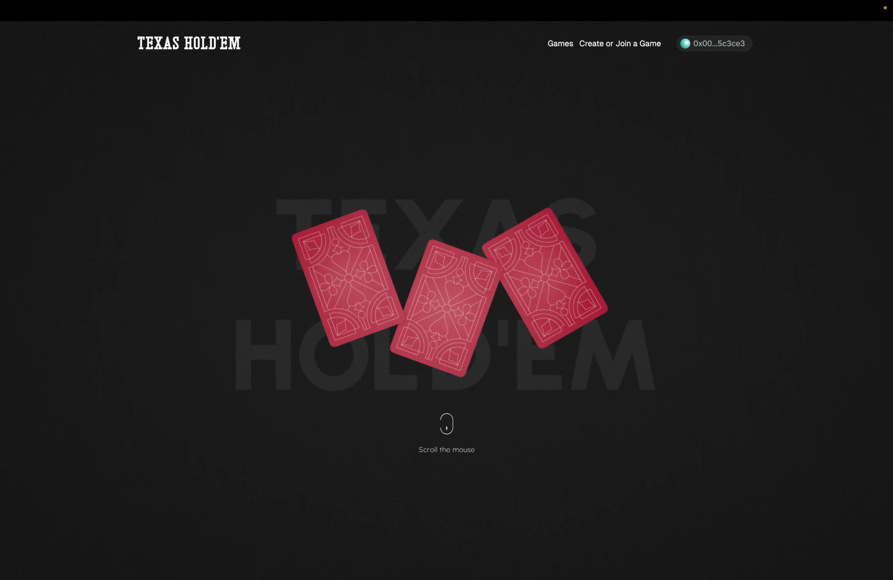
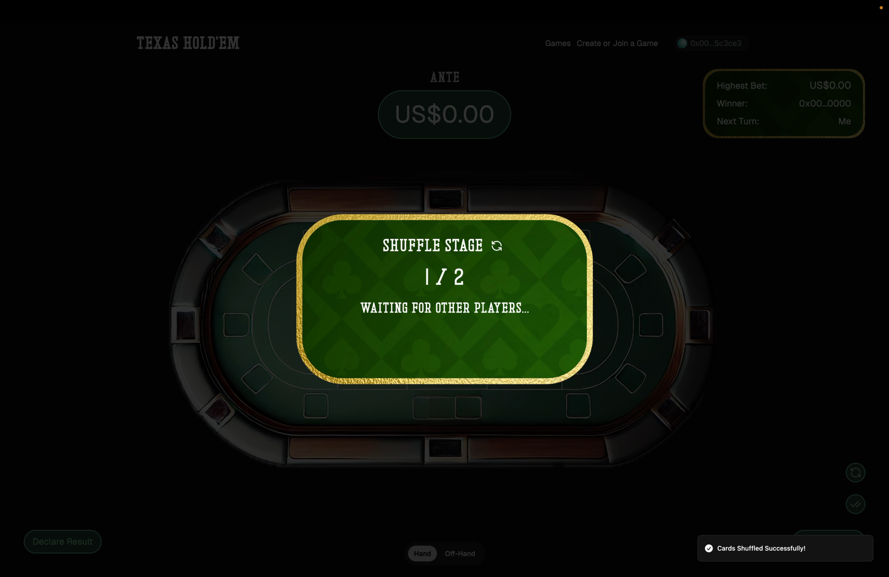
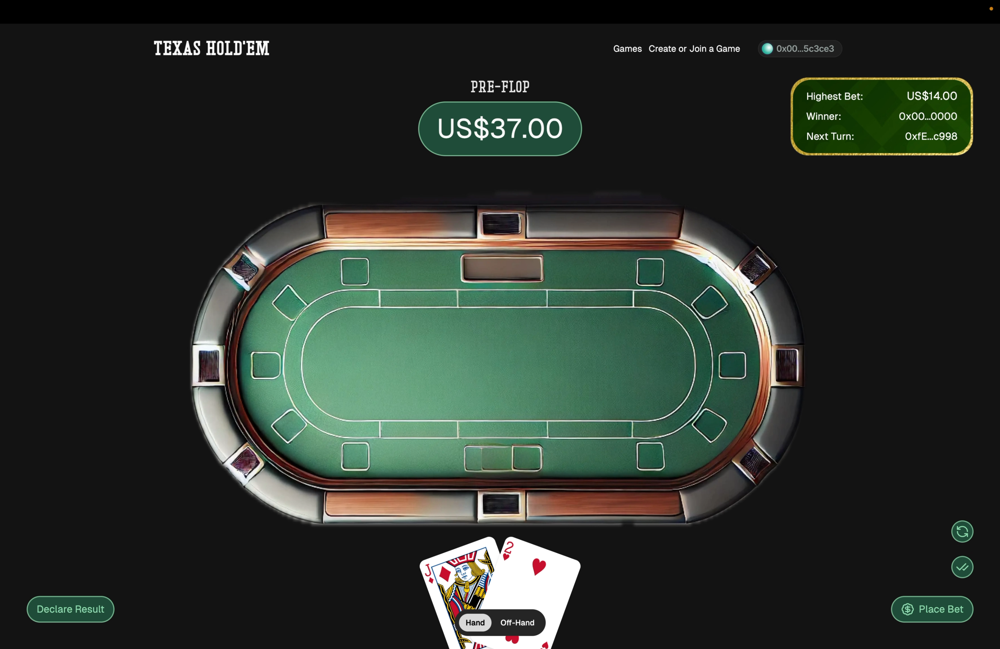
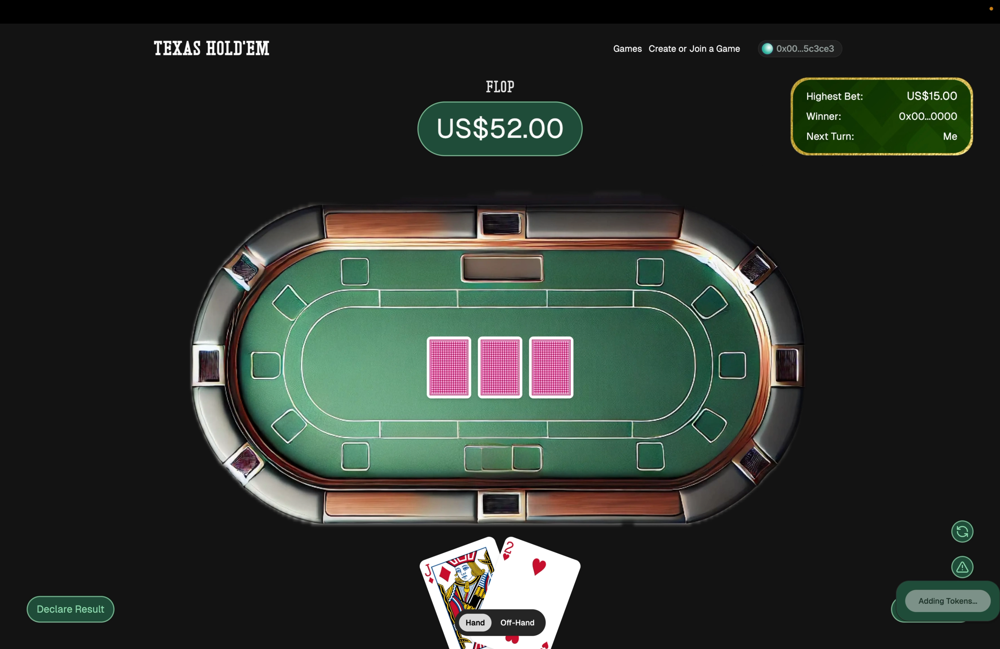
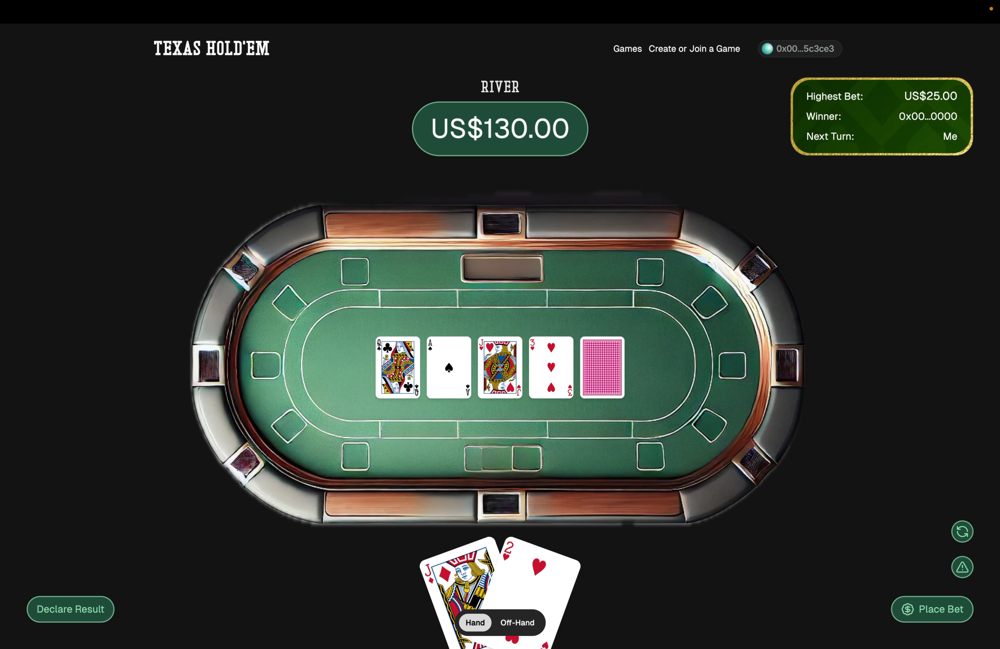
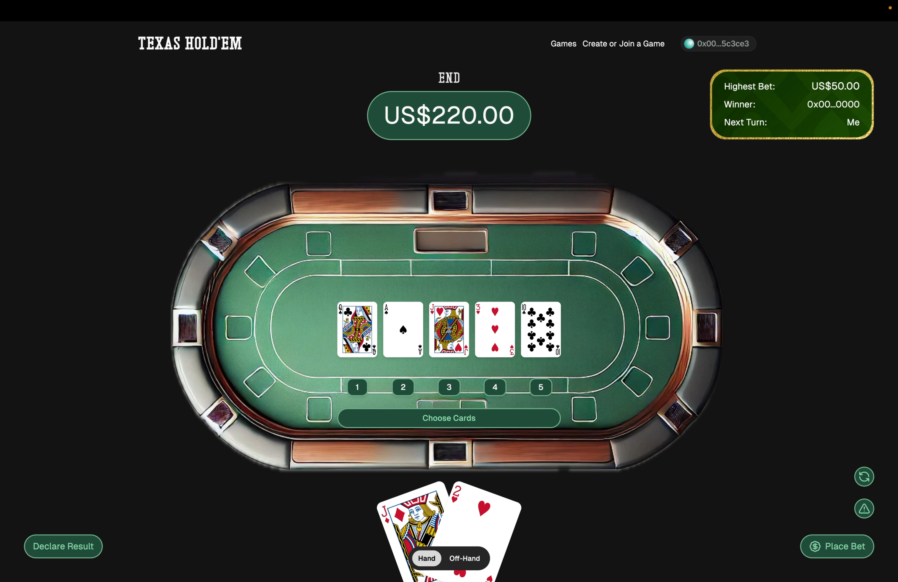
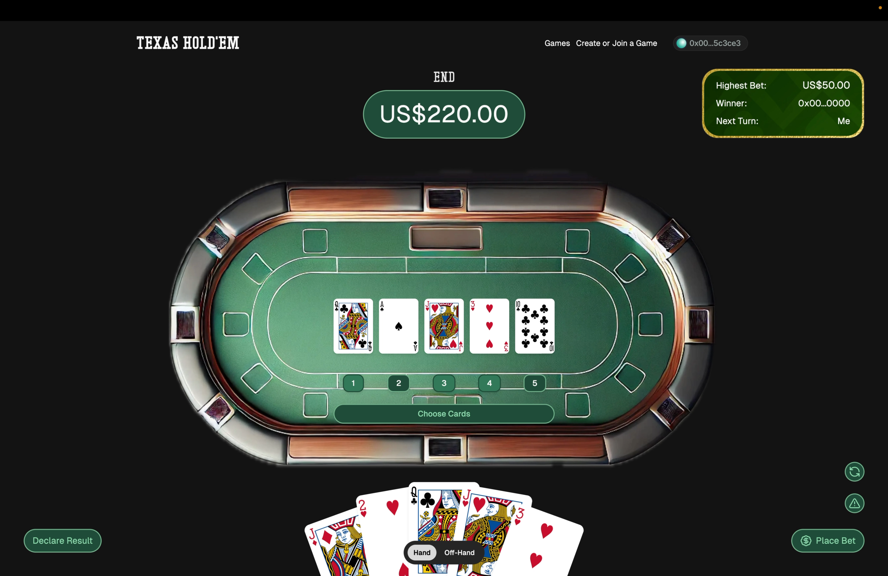
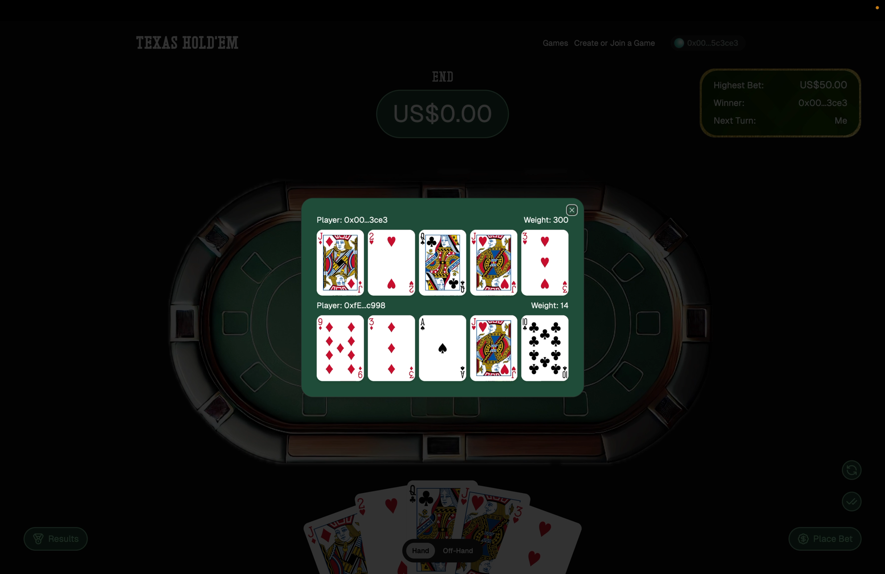

<p align="center">
</p>

<h1 align="center">Showdown</h1>

<p align="center">
  <strong>Fully on-chain Texas Hold'em with ZK-verified card shuffling</strong>
</p>

<p align="center">
  No server holds the deck. No operator can see your cards. Every shuffle is a zero-knowledge proof.
</p>

<p align="center">
  <a href="#-status">Status</a> •
  <a href="#-how-it-works">How It Works</a> •
  <a href="#-security-model">Security Model</a> •
  <a href="#-roadmap-avalanche-c-chain">Roadmap</a> •
  <a href="#-get-started">Get Started</a>
</p>

---

## 📍 Status

Showdown is an EVM poker engine — standard Solidity, portable across EVM chains. A working
prototype is deployed and playable on **Lisk Sepolia** testnet.

| | |
|---|---|
| **Live demo** | [texas-seven.vercel.app](https://texas-seven.vercel.app) |
| **Demo video** | [YouTube](https://www.youtube.com/watch?v=1lw5bxYwsPk) |
| **Deployments** | Lisk Sepolia (original prototype) · Avalanche Fuji (migration in progress) |
| **Next target** | Avalanche C-Chain — see [Roadmap](#-roadmap-avalanche-c-chain) |
| **Stage** | Prototype. Testnet funds only, not audited, not for real-money play. |

### Deployed Contracts — Lisk Sepolia

- **Game Factory**: [`0xe86553AE8f33924b5B7174F64ceaCbeff473548D`](https://sepolia-blockscout.lisk.com/address/0xe86553AE8f33924b5B7174F64ceaCbeff473548D)
- **Reveal Verifier**: [`0x49cFFa95ffB77d398222393E3f0C4bFb5D996321`](https://sepolia-blockscout.lisk.com/address/0x49cFFa95ffB77d398222393E3f0C4bFb5D996321)

### Deployed Contracts — Avalanche Fuji

- **Game Factory**: [`0xBf3c326C76A7dB1Cf547A075252034e12A73050F`](https://testnet.snowtrace.io/address/0xBf3c326C76A7dB1Cf547A075252034e12A73050F)
- **Reveal Verifier**: [`0xAE5d214ecE811D3B65E42f7018e8fD77f16ebb78`](https://testnet.snowtrace.io/address/0xAE5d214ecE811D3B65E42f7018e8fD77f16ebb78)

Point the frontend at Fuji with `NEXT_PUBLIC_CHAIN_ID=43113`. To redeploy:

```bash
cd packages/contracts
forge script script/Deploy.s.sol --rpc-url fuji --broadcast   # reads PRIVATE_KEY from .env
```

The script deploys a fresh `RevealVerifier` on any chain other than Lisk Sepolia, then `GameFactory`,
linking the `QuickSort` and `TexasPoker` libraries automatically.

---

## 🎯 Features

- **Trustless card shuffling** — ZK-SNARK proofs (Zypher Network's ZK Shuffle SDK) prove each shuffle is a valid permutation without revealing card order
- **Real stakes** — smart contracts hold and distribute the pot; no IOU accounting
- **Strategic showdown** — choose 3 of 5 community cards, so hand construction is a skill decision rather than automatic
- **Anti-griefing** — 120-second action timeout with permissionless `forceFold()`
- **Auto-decryption** — cards reveal as soon as all reveal tokens are submitted
- **Readable errors** — raw revert data translated to plain language

---

## 🔐 Security Model

Showdown is honest about which parts are trustless today and which are not.

**Trustless (verified on-chain):**
- Card revealing via ZK proofs
- Hand evaluation (`TexasPoker.sol`)
- Pot custody and distribution (immutable contract logic)

**Not yet trustless:**
- **Shuffle verification runs client-side.** Players generate valid ZK shuffle proofs, but those
  proofs are not currently checked on-chain.

### Why, precisely

`ZgShuffleVerifier` — the contract that would verify shuffle proofs on-chain — compiles to
**27,002 bytes** of runtime bytecode. [EIP-170](https://eips.ethereum.org/EIPS/eip-170) caps
deployed contracts at **24,576 bytes**. It overshoots by 2,426 bytes:

```
$ forge build --sizes
| Contract             | Runtime Size (B) | Runtime Margin (B) |
| ZgShuffleVerifier    |           27,002 |             -2,426 |
| VerifierKeyExtra1_52 |           16,454 |              8,122 |
| VerifierKeyExtra2_52 |           16,450 |              8,126 |
| GameFactory          |           15,369 |              9,207 |
| Game                 |           14,037 |             10,539 |
| RevealVerifier       |            6,964 |             17,612 |
Error: some contracts exceed the runtime size limit (EIP-170: 24576 bytes)
```

Two things worth stating plainly, because both are commonly gotten wrong:

1. **This is not a Lisk limitation.** EIP-170 is enforced identically by every major EVM chain —
   Base, Optimism, Arbitrum, and Avalanche C-Chain included. Changing chains does not fix it.
2. **Compiler settings do not fix it either.** Rebuilding with `optimizer_runs = 1` yields 26,974
   bytes — still 2,398 over.

### Where the bytes actually go

Profiling the vendored verifier turned up two specific causes, both addressable:

| Change | `ZgShuffleVerifier` runtime size | Margin |
|---|---|---|
| As shipped | 27,002 | −2,426 |
| Externalize the inlined `VerifierKey_52` table | 24,735 | −159 |
| Drop the unused `verifyGenericProof` entry point | **20,755** | **+3,821** ✅ |

`PlonkVerifier.verifyProof` is `private` and reached from two public entry points that differ only
by a constant `bool`. The optimizer specializes the ~6KB verifier body for each, so the contract
carries two near-identical copies — and the generic one is never called by this project, which only
verifies shuffle proofs. Removing it saves 6,247 bytes and brings the verifier comfortably under
EIP-170 on its own.

The `VerifierKey_52` externalization is independent and worth 2,267 bytes. The mechanism already
exists here: `VerifierKeyExtra1_52` and `VerifierKeyExtra2_52` are deployed as standalone contracts
and `staticcall`'d directly into memory.

### This is an upstream limitation, not a local one

The verifier sources are byte-identical to [zypher-game/uzkge](https://github.com/zypher-game/uzkge).
Upstream's own reference deployment contract, `ShuffleService`, inlines both the 20- and 52-card key
tables and compiles to **31,072 bytes** — 6,496 over EIP-170. Upstream ships no real deployment
script (`scripts/deploy.js` is the stock Hardhat sample) and configures no live network; the Solidity
verifier is exercised only against an in-memory Hardhat node. Zypher's production answer is
[zytron-precompiles](https://github.com/zypher-game/zytron-precompiles), which provides PLONK and
shuffle verification as native precompiles on their own L2 — going under EIP-170 rather than fitting
inside it.

So the client-side shuffle here was never a shortcut. On any EIP-170 chain it is the only option the
SDK offers as shipped.

### Verified

[`test/ShuffleVerify52.t.sol`](./packages/contracts/test/ShuffleVerify52.t.sol) deploys the
size-reduced verifier and runs it against **upstream's own 52-card proof vector**, lifted verbatim
from `uzkge/contracts/solidity/test/plonk_52.js` — Zypher's proof, not one generated to match this
implementation.

```
[PASS] test_verifierFitsUnderEip170()        ZgShuffleVerifier runtime size: 20,755 / 24,576
[PASS] test_verifiesUpstream52CardProof()    valid proof accepted
[PASS] test_rejectsTamperedProof()           corrupted proof rejected
[PASS] test_reportVerificationGas()          2,383,293 gas
```

**On-chain shuffle verification costs ~2.38M gas per shuffle.** Every player shuffles, so an
_n_-player hand pays that _n_ times.

Against Avalanche C-Chain fees that is affordable. At a spot base fee of ~0.061 gwei
(60,946,345 wei, sampled from `api.avax.network` in July 2026), one verification costs roughly
**0.000145 AVAX** — a fraction of a cent, so a heads-up hand adds well under a cent of verification
cost. Congestion raises this, and the figure is a point sample rather than a benchmark; producing
proper numbers across real gameplay is part of milestone 1.

**Until this lands in the deployed game:** testnet play only. Treat the shuffle as
fair-by-convention, not fair-by-proof.

---

## 🗺 Roadmap: Avalanche C-Chain

The engine is chain-agnostic Solidity, so the migration is mostly mechanical — with one genuine
piece of engineering.

**1. Turn on on-chain shuffle verification**
Sizing and correctness are already proven (see [Security Model](#-security-model)): the verifier
fits at 20,755 bytes and accepts upstream's real 52-card proof, at ~2.38M gas. What remains is
integration and economics — deploy the verifier, wire `Game.sol` to call `verifyShuffle` at shuffle
submission, benchmark real cost per hand at C-Chain fees, and decide where verification stays
affordable. This removes the last trust assumption in the protocol.

**1b. Upstream the fix**
The EIP-170 fix applies to every game built on Zypher's SDK, not just this one. Worth a PR to
`zypher-game/uzkge`.

**2. Deploy to Fuji, then C-Chain**
Add the chain definitions (`apps/www/src/lib/viem/chains.ts`, `packages/contracts/foundry.toml`),
deploy via the existing Foundry scripts, publish gas benchmarks for a full hand.

**3. Tournament mode**
Sponsor-funded prize-pool contracts, faucet chips for onboarding, Elo ratings, session-key UX so a
hand doesn't require a wallet popup per action.

**4. Mainnet and first players**
Community tournaments, targeting 100+ unique players.

---

## 🎮 How It Works

The game runs an 8-stage flow from shuffle to payout:

```
Shuffle → Ante → Pre-Flop → Flop → Turn → River → End (Choose Cards) → Winner
```

### Stage 1: Shuffle

Every player shuffles the deck before betting opens.

1. **Player 1** generates a masked deck + public key commitment + SNARK proof, submits on-chain
2. **Players 2–N** fetch the on-chain deck, shuffle, generate a SNARK proof, submit
3. Play begins only when all players have shuffled

Each shuffle is cryptographically proven to be a valid permutation without revealing card order.
(See [Security Model](#-security-model) for where that proof is currently checked.)

### Stages 2–6: Betting Rounds

| Round | Cards Revealed | Action Required |
|-------|---------------|-----------------|
| **1. Ante** | None | Initial pot contribution |
| **2. Pre-Flop** | 2 hole cards per player | Bet + submit reveal tokens for opponents' cards |
| **3. Flop** | 3 community cards | Bet + submit reveal tokens |
| **4. Turn** | 4th community card | Bet + submit reveal tokens |
| **5. River** | 5th community card | Bet + submit reveal tokens |

Bets are transfers of the chain's native token, sent with the transaction. Players must call or
raise the current high bet, or fold and forfeit their stake. Each action carries a 120-second
timeout; any player may call `forceFold()` once it expires.

### Card Reveal System

1. **Submit reveal tokens** — derived from your secret key, these let others decrypt specific cards
   without ever exposing the key itself
2. **Auto-decryption** — once all tokens for a card are in, it decrypts automatically (2-second
   refresh); no further action needed
3. **Privacy** — only you can decrypt your hole cards until the End round; community cards decrypt
   once all tokens are submitted

### Stage 7: End Round — Strategic Choice

After River betting, each player picks **3 of the 5 community cards** and submits via
`chooseCards()`.

```
[Hole Card 1] [Hole Card 2] [Community] [Community] [Community]
     ↑             ↑             ↑           ↑           ↑
   fixed         fixed      your choice  your choice  your choice
```

```
Your hole: [A♠ K♠]
Community: [Q♠ J♠ 10♠ 2♦ 7♣]
            1   2   3   4  5

Pick 1, 2, 3 → [A♠ K♠ Q♠ J♠ 10♠] = Royal Flush 🏆
```

Standard Hold'em picks your best five automatically. Showdown makes you do it — hand reading
becomes a skill the player exercises, not a function the client calls.

### Stage 8: Winner Determination

1. `TexasPoker.sol` evaluates each player's 5-card hand
2. Each hand receives a weight — Royal Flush 9000+, High Card 0–999
3. Highest weight wins; the pot transfers immediately
4. `claimWinnings()` remains available as a fallback if the automatic transfer fails

**Hand rankings** (see [TexasPoker.sol](./packages/contracts/src/libraries/TexasPoker.sol)):
Royal Flush 9000+ · Straight Flush 8000+ · Four of a Kind 7000+ · Full House 6000+ · Flush 5000+ ·
Straight 4000+ · Three of a Kind 3000+ · Two Pair 2000+ · Pair 1000+ · High Card 0–999

---

## 🧑🏼‍💻 Tech Stack

- **Smart contracts** — Solidity, Foundry
- **ZK** — `@zypher-game/secret-engine`, Groth16 / Plonk over BN254
- **Frontend** — Next.js, Tailwind CSS, shadcn/ui
- **Web3** — wagmi, viem, web3modal
- **Backend** — Hono

---

## 🚀 Get Started

Turborepo monorepo. `apps/www` is the Next.js application; `packages/contracts` is the Foundry project.

```bash
# Clone with submodules (forge-std, openzeppelin-contracts)
git clone --recurse-submodules https://github.com/oderahub/showdown.git
cd showdown

pnpm install
pnpm dev
```

Contracts:

```bash
cd packages/contracts
forge build --sizes    # note: ZgShuffleVerifier exceeds EIP-170, see Security Model
forge test
```

---

## 📸 Screenshots

<table>
  <tr>
    <td valign="top" width="50%"></td>
    <td valign="top" width="50%"></td>
  </tr>
  <tr>
    <td valign="top" width="50%"></td>
    <td valign="top" width="50%"></td>
  </tr>
  <tr>
    <td valign="top" width="50%"></td>
    <td valign="top" width="50%"></td>
  </tr>
  <tr>
    <td valign="top" width="50%"></td>
    <td valign="top" width="50%"></td>
  </tr>
</table>

---

## 🎥 Demo

[](https://www.youtube.com/watch?v=1lw5bxYwsPk)

---

Built with [Zypher Network's](https://zypher.network) ZK Shuffle SDK.
